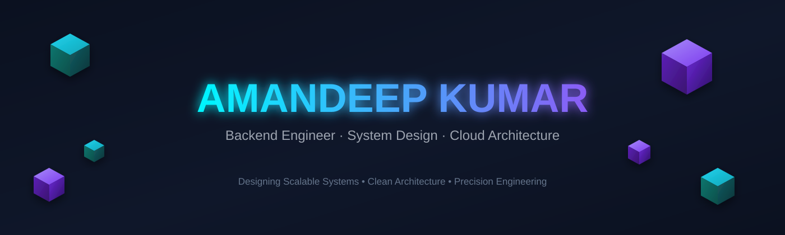
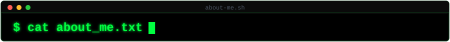
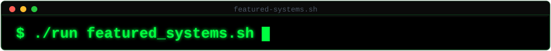
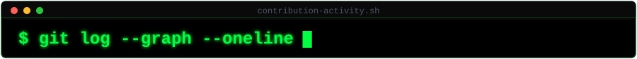
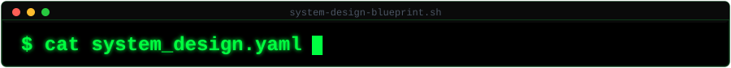
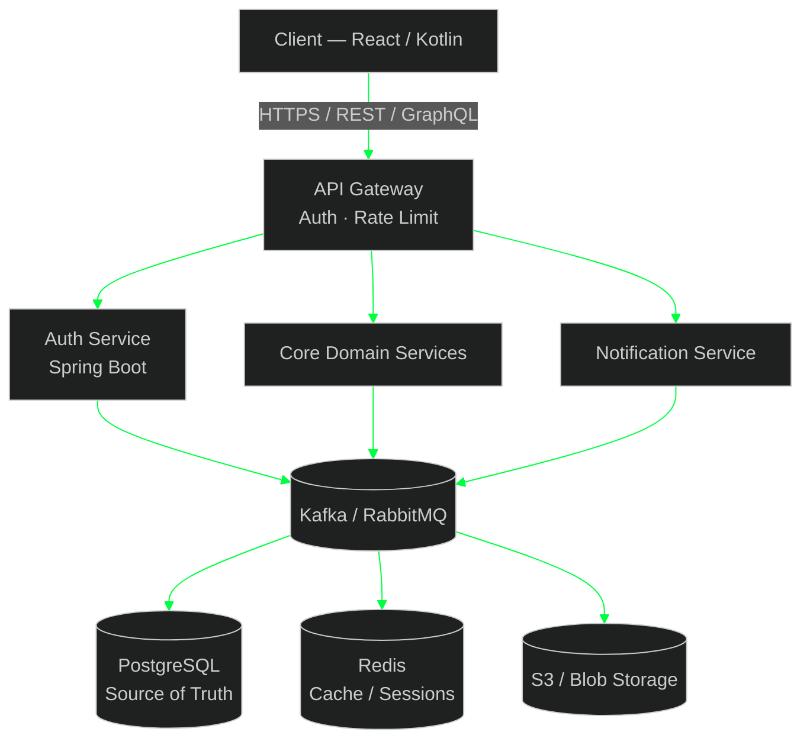

<!-- ================= HERO BANNER (animated matrix rain terminal) ================= -->
<p align="center">
  
</p>

<!-- ================= TERMINAL TYPING LINE ================= -->
<p align="center">
  
</p>

<!-- ================= STATUS BADGES ================= -->
<p align="center">
  
  
  
  
</p>


<!-- ================= ABOUT ================= -->
<p align="center"></p>

```bash
$ cat about_me.txt

  name        : Amandeep Kumar
  role        : Full-Stack / Backend Engineer
  education   : B.Tech, Computer Science
  philosophy  : "Design for scale. Build for clarity. Ship with precision."

  currently_building:
    -> Suraksha Bank   : full-stack net banking platform (MFA, ledgers, loans, admin RBAC)
    -> Suraksha Cover  : insurance management platform (Spring Boot 3 + React)

  interests:
    -> System Design & Distributed Architecture
    -> Clean Architecture & SOLID Principles
    -> Performance Engineering & Observability

$ _
```


<!-- ================= TECH STACK ================= -->
<p align="center"></p>

<p align="center">
  
</p>

**`$ languages/`**
<p align="center"></p>

**`$ backend_and_frameworks/`**
<p align="center"></p>

**`$ frontend/`**
<p align="center"></p>

**`$ databases_and_caching/`**
<p align="center"></p>

**`$ cloud_devops_and_infra/`**
<p align="center"></p>

**`$ messaging_testing_and_tools/`**
<p align="center"></p>

<p align="center">
  
  
  
  
  
  
</p>
<p align="center">
  
  
  
  
  
</p>
<p align="center">
  
  
  
  
  
  
</p>


<!-- ================= FEATURED PROJECTS ================= -->
<p align="center"></p>

<table align="center">
<tr>
<td width="50%" valign="top">

```
$ ./run suraksha_bank.sh
```
**🏦 Suraksha Bank**
Full-stack net banking simulation modeled on Indian retail banks.
- Multi-factor authentication & full transaction ledger
- Loan / FD / RD lifecycle engine
- Digital gold & insurance modules
- Admin RBAC panel + 4-year synthetic transaction history

`Java` `Spring Boot` `React` `PostgreSQL`

</td>
<td width="50%" valign="top">

```
$ ./run suraksha_cover.sh
```
**🛡️ Suraksha Cover**
Insurance management platform with role-based portals.
- Admin / Agent / Customer portals
- Two-step OTP login & scoped data access
- Self-service registration & approval flow
- Chart.js dashboards, Framer Motion UI

`Spring Boot 3` `Java 21` `React` `Vite` `Tailwind`

</td>
</tr>
<tr>
<td width="50%" valign="top">

```
$ ./run medisphere.sh
```
**🩺 MediSphere**
Production-grade hospital management system.
- 118 files, Flyway migrations, Cloudinary storage
- Gemini AI integration
- Java 21 + Spring Boot 3, React 19

`Java` `Spring Boot` `React` `PostgreSQL`

</td>
<td width="50%" valign="top">

```
$ ./run redline.sh
```
**🔍 Redline — AI Code Review Assistant**
Static analysis + LLM-powered review engine.
- Java static analyzer + GPT-4o-mini review layer
- Line-annotated "review gutter" UI
- Neon + Render + Vercel deployment pipeline

`Spring Boot` `React` `OpenAI API`

</td>
</tr>
</table>


<!-- ================= STATS ================= -->
<p align="center"></p>

<p align="center">
  
  
</p>
<p align="center">
  
</p>

<sub>$ note — trophy/stats cards are free third-party services (Vercel-hosted) and occasionally rate-limit or go down for a few minutes. If a card shows broken here, right-click → open the image URL directly in a new tab: if that also fails, it's the service being down, not your repo — just wait and hard-refresh later. If it loads fine standalone but not on GitHub, it's GitHub's ~30min image cache — hard-refresh (Cmd+Shift+R) fixes it.</sub>

> **`$ debug streak_card`** — if it still shows 0 / empty: GitHub → Settings → Profile → enable **"Include private contributions on my profile"**. The streak service only sees what your public contribution graph shows. GitHub also caches these images ~30 min via its proxy, so hard-refresh after fixing.

<!-- ================= CONTRIBUTION GRAPH ================= -->
<p align="center"></p>

<p align="center">
  
</p>

<p align="center">
  
</p>
<p align="center"><sub>$ snake.sh — requires a one-time GitHub Action, see setup notes below.</sub></p>


<!-- ================= SYSTEM DESIGN BLUEPRINT ================= -->
<p align="center"></p>



<sub>$ note — GitHub renders Mermaid natively, dark-themed to match the terminal aesthetic.</sub>

<!-- ================= FOOTER (animated matrix rain terminal) ================= -->
<p align="center">
  
</p>

---

### `$ setup.sh` — do these once in your repo

1. **Unzip and upload the whole thing.** Extract the zip, then on `github.com/amanDeep080/amanDeep080` → **Add file → Upload files** → drag in `README.md` and the entire `assets` folder together, so `assets/banner.svg` etc. sit at the repo root next to the README. Commit directly to `main`.
2. **Fix the streak card**: GitHub → Settings → Profile → enable *"Include private contributions on my profile"* if most of your work is on private repos.
3. **Enable the snake animation**: add a workflow using [`Platane/snk`](https://github.com/Platane/snk) to `.github/workflows/` in this repo — it generates and commits `github-contribution-grid-snake-dark.svg` to an `output` branch, which the snake image above points to.
